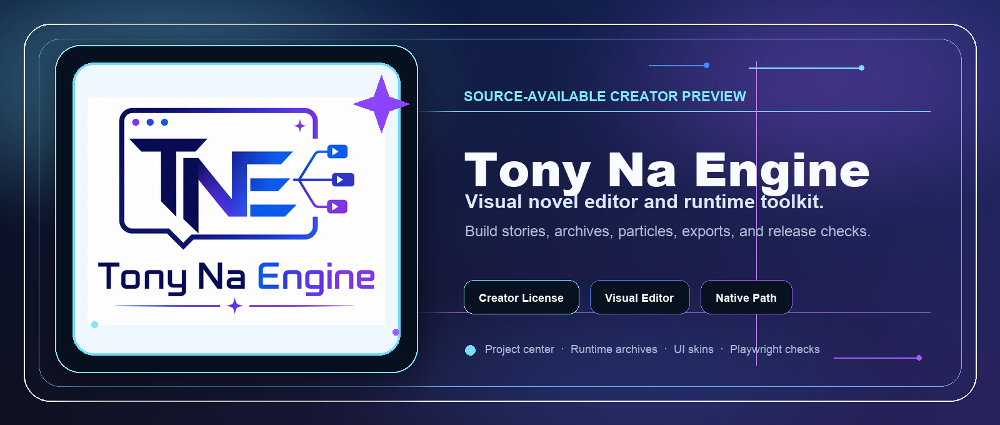

<p align="center">
  
</p>

<h1 align="center">Tony Na Engine</h1>

<p align="center">
  一套面向视觉小说 / Galgame 创作者的可视化引擎原型。<br />
  目标是让“不懂编程的人”，也能用上传素材、输入台词、点按钮和可视化编辑的方式完成游戏开发。
</p>

<p align="center">
  
  
  
  
</p>

<p align="center">
  <a href="#快速开始">快速开始</a> ·
  <a href="#当前已经有的核心能力">核心能力</a> ·
  <a href="#功能状态">功能状态</a> ·
  <a href="#发布状态">发布状态</a> ·
  <a href="CONTRIBUTING.md">参与贡献</a>
</p>

---

## 项目定位

Tony Na Engine 当前更适合这样理解：

- `源码可见创作者预览版`
- `Early Access / Preview`
- `适合独立开发者、同人作者、内部测试成员先拿来试做项目`

当前版本已经具备较完整的编辑器能力、导出能力和自动化测试基础，但仍然保留以下发布边界：

- 已接入后端 smoke、浏览器 Playwright smoke 和发布前自检脚本
- 适合做小型项目试制、导出链验证、功能体验和问题反馈
- 仍按 **Preview / Early Access** 口径发布；正式商业稳定版会在签名、公证、安装器和长流程点测进一步完成后单独标记

## 当前已经有的核心能力

- 可视化剧情编辑器
- 项目中心与空白新建项目
- 新手模式 / 高级模式分层
- 角色、素材、台词台本、配音工作流
- 项目巡检、一键发布前修复顺序、自动回归试玩路线测试
- Tony Na Assistant 智能创作助手：支持零配置本地模板，也支持创作者自带 OpenAI API Key 调用真模型生成剧情、建议、素材提示和可导出的灵感包
- 正式存档 / 读档、系统菜单
- 项目级成品 UI 皮肤、UI Kit 部件绑定、九宫格贴图、按钮多状态贴图、布局位置微调与视觉小说文本框设计
- EXTRA 回想馆、图鉴馆、成就馆、章节回放、结局回放、语音回听
- 高级粒子系统、项目级粒子预设库
- 网页试玩包、Windows 桌面包、编辑器桌面包、三系统编辑器套装
- 自动化测试体系（后端 smoke + Playwright 浏览器烟测）

## 功能状态

| 模块 | 当前状态 | 说明 |
| --- | --- | --- |
| 剧情 / 分支编辑 | 可用 | 支持可视化卡片、选项跳转、条件与变量、场景树筛选。 |
| 素材管理 | 可用 | 支持背景、角色、CG、BGM、音效、语音、字体等素材导入、替换、删除与使用保护。 |
| 智能创作助手 | 可用 | 默认本地模板；可选自带 OpenAI API Key 的真模型模式；支持灵感盒、卡片预览、勾选插入与导出。 |
| 项目安全网 | 可用 | 支持自动快照、版本恢复、崩溃恢复、正式存档 / 读档与发布前检查。 |
| 成品 UI 自定义 | 可用 | 支持项目级 UI 皮肤、按钮多状态、九宫格贴图、布局位置与视觉小说文本框设计。 |
| EXTRA / 回想系统 | 可用 | 支持图鉴馆、回想馆、成就馆、章节回放、结局回放与语音回听。 |
| 粒子与演出 | 可用 | 支持高级粒子预设、项目级自定义粒子、镜头、滤镜、闪屏、震动等演出配置。 |
| 网页 / 桌面导出 | Preview | 网页试玩包与三平台桌面包可用；签名、公证和安装器状态以 Release notes 为准。 |
| 原生 Runtime | Preview | 已覆盖核心播放链、存档、设置、历史文本、自动播放、视频兜底与第一批资料馆。 |
| 手机端 Runtime | 实验规划 | 当前处于触控、音频策略和界面适配验证阶段。 |

## 仓库结构

- [`run_editor.py`](run_editor.py)  
  本地编辑器服务、导出链、项目管理、打包链的主入口

- [`prototype_editor`](prototype_editor)  
  编辑器前端

- [`export_player_template`](export_player_template)  
  导出后玩家端 Runtime 模板

- [`template_project`](template_project)  
  示例项目

- [`tests`](tests)  
  自动化测试

## 智能创作助手

剧情编辑页内置 `Tony Na Assistant`：

- 默认使用本地模板模式，不需要联网，不会上传项目内容，也不会产生 API 费用
- 创作者可自带 OpenAI API Key，并在面板里切换到 `OpenAI 真模型`，用于生成更自由的剧情片段、创作建议、场景润色和素材概念提示
- API Key 不会写入项目文件；只有勾选“只在本浏览器记住 Key”时，才会保存在当前浏览器的 localStorage
- 真模型不可用或未填写 Key 时，会自动回落到本地模板助手，避免创作流程被卡住
- 生成结果会进入本地“灵感盒”，可恢复、删除或导出为 `.tn-idea.json`；灵感盒同样只保存在当前浏览器
- 插入前可以预览、勾选将要写入的剧情卡片，并复制成台本文本，方便创作者先审稿或发给协作者

## 快速开始

### 运行环境

- Python 3
- macOS / Windows / Linux

启动编辑器默认只需要 Python 3。

### 启动编辑器

最简单的方式是使用对应系统的启动脚本：

- macOS：双击 [`start_editor.command`](start_editor.command)
- Windows：双击 [`start_editor.cmd`](start_editor.cmd)
- Linux：运行 [`start_editor.sh`](start_editor.sh)

或者命令行启动。下面这些命令逻辑是通用的，主要差别只是不同系统里 Python 启动器名字不一样：

macOS / Linux：

```bash
git clone https://github.com/TonyNa-code/tony-na-engine.git
cd tony-na-engine
python3 run_editor.py
```

Windows：

```bat
git clone https://github.com/TonyNa-code/tony-na-engine.git
cd tony-na-engine
py -3 run_editor.py
```

如果 Windows 没有 `py` 启动器，也可以改用：

```bat
python run_editor.py
```

## 下载与导出

### 编辑器 App

编辑器预览包通过 GitHub Releases 分发。当前计划提供：

- `macos.tar.gz`
- `windows.zip`
- `linux.tar.gz`

预览包用于快速体验编辑器本体，不需要从源码启动。若某个平台包尚未出现在 Release 附件中，以该版本 Release notes 为准。

### 游戏成品导出

打开项目后，可在编辑器的 `预览导出` 页生成游戏成品包：

- 网页试玩包
- Windows 桌面包
- macOS 桌面包
- Linux 桌面包
- 原生 Runtime 包（Preview，含独立 App 打包脚手架）

### 平台状态

- `网页试玩包`：适合快速预览、网页分发和轻量测试。
- `Windows / macOS / Linux 桌面包`：当前主要基于 NW.js 桌面 Runtime。
- `原生 Runtime 包`：Preview 路线，已覆盖标题页主菜单、基础剧情主链、正式存档/读档、系统菜单设置项、文本历史、自动播放、已读快进、项目字体、玩家档案/自动续玩、基础粒子与镜头演出、可选 PyAV/FFmpeg 音画同步内嵌视频播放、OpenCV 画面兜底、系统播放器桥接兜底，以及第一批资料馆和详情查看能力。
- `手机端 Runtime`：实验规划阶段，当前重点是触控、音频策略和界面适配验证。

## 测试

### 测试环境准备

浏览器自动化测试依赖 Playwright。第一次运行前建议先执行：

macOS / Linux：

```bash
cd tony-na-engine
python3 -m pip install -r requirements-dev.txt
python3 -m playwright install chromium
```

Windows：

```bat
cd tony-na-engine
py -3 -m pip install -r requirements-dev.txt
py -3 -m playwright install chromium
```

### 本地检查

前端脚本与关键 Python 文件语法检查：

macOS / Linux：

```bash
cd tony-na-engine
node --check prototype_editor/app.js
node --check export_player_template/player.js
python3 -m py_compile run_editor.py
```

Windows：

```bat
cd tony-na-engine
node --check prototype_editor/app.js
node --check export_player_template/player.js
py -3 -m py_compile run_editor.py
```

### 自动化测试

后端 smoke：

macOS / Linux：

```bash
cd tony-na-engine
python3 -m unittest discover -s tests -p 'test_run_editor_smoke.py' -v
```

Windows：

```bat
cd tony-na-engine
py -3 -m unittest discover -s tests -p "test_run_editor_smoke.py" -v
```

浏览器 Playwright：

macOS / Linux：

```bash
cd tony-na-engine
python3 -m unittest discover -s tests -p 'test_browser_playwright_smoke.py' -v
```

Windows：

```bat
cd tony-na-engine
py -3 -m unittest discover -s tests -p "test_browser_playwright_smoke.py" -v
```

或者直接运行对应系统脚本：

- macOS：[`run_tests.command`](run_tests.command) / [`run_browser_tests.command`](run_browser_tests.command)
- Windows：[`run_tests.cmd`](run_tests.cmd) / [`run_browser_tests.cmd`](run_browser_tests.cmd)
- Linux：[`run_tests.sh`](run_tests.sh) / [`run_browser_tests.sh`](run_browser_tests.sh)

### GitHub Actions

仓库已内置 CI，会在 `push / pull request` 时自动执行：

- Python 语法检查
- 前端脚本语法检查
- 后端 smoke 测试
- Playwright 浏览器烟测

## 发布状态

当前仓库以 **源码可见创作者预览版** 方式维护。

- 源码可直接在本地启动与修改
- 自动化测试已经接通
- GitHub Releases 可用于提供编辑器可运行包
- 导出链和桌面打包链已经具备原型级完整度

## 其他设计文档

更早期的引擎规划和数据设计可参考：

- [`galgame_engine_blueprint.md`](galgame_engine_blueprint.md)
- [`v1_ui_structure.md`](v1_ui_structure.md)
- [`v1_data_format.md`](v1_data_format.md)

## 许可说明

当前仓库采用 **Tony Na Engine Creator License 1.0**：

- [`LICENSE`](LICENSE)

这份许可的核心口径是：

- 允许使用本引擎制作并商业发布游戏
- 允许为了自己的项目修改引擎
- 不允许把引擎本体或修改版引擎当作引擎产品再次商业化出售

因此它不是标准 OSI 意义上的开源协议，而是更接近“源码可见 / source-available”的创作者许可。

## 贡献

欢迎提 Issue、提想法、做测试反馈。

贡献前建议先看：

- [`CONTRIBUTING.md`](CONTRIBUTING.md)
- [`CODE_OF_CONDUCT.md`](CODE_OF_CONDUCT.md)
- [`SECURITY.md`](SECURITY.md)

Issue / PR 入口：

- [Bug report](.github/ISSUE_TEMPLATE/bug_report.md)
- [Feature request](.github/ISSUE_TEMPLATE/feature_request.md)
- [Pull request template](.github/pull_request_template.md)
