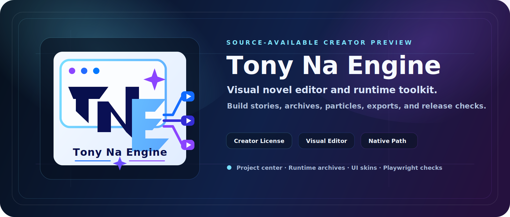

<p align="center">
  
</p>

<h1 align="center">Tony Na Engine</h1>

<p align="center">
  一套面向视觉小说 / Galgame 创作者的可视化引擎原型。<br />
  目标是让“不懂编程的人”，也能用上传素材、输入台词、点按钮和可视化编辑的方式完成游戏开发。
</p>

<p align="center">
  
  
  
  
</p>

<p align="center">
  <a href="#快速开始">快速开始</a> ·
  <a href="#当前已经有的核心能力">核心能力</a> ·
  <a href="#免费预览版分发">预览版分发</a> ·
  <a href="#商业签名--公证">商业签名 / 公证</a> ·
  <a href="CONTRIBUTING.md">参与贡献</a>
</p>

---

## 项目定位

Tony Na Engine 当前更适合这样理解：

- `开源创作者预览版`
- `Early Access / Preview`
- `适合独立开发者、同人作者、内部测试成员先拿来试做项目`

当前版本已经具备较完整的编辑器能力、导出能力和自动化测试基础，但仍然保留以下发布边界：

- 自动化测试已经比较完整
- 但完整人工逐按钮长流程点测还没有全部做完
- 因此当前更适合作为**开源预览版**使用，而不是完全稳定的正式商业版

## 当前已经有的核心能力

- 可视化剧情编辑器
- 项目中心与空白新建项目
- 新手模式 / 高级模式分层
- 角色、素材、台词台本、配音工作流
- 项目巡检、一键发布前修复顺序、自动回归试玩路线测试
- 正式存档 / 读档、系统菜单
- EXTRA 回想馆、图鉴馆、成就馆、章节回放、结局回放、语音回听
- 高级粒子系统、项目级粒子预设库
- 网页试玩包、Windows 桌面包、编辑器桌面包、三系统编辑器套装
- 自动化测试体系（后端 smoke + Playwright 浏览器烟测）

## 仓库结构

- [`run_editor.py`](run_editor.py)  
  本地编辑器服务、导出链、项目管理、打包链的主入口

- [`prototype_editor`](prototype_editor)  
  编辑器前端

- [`export_player_template`](export_player_template)  
  导出后玩家端 Runtime 模板

- [`template_project`](template_project)  
  示例项目

- [`tests`](tests)  
  自动化测试

## 快速开始

### 运行环境

- Python 3
- macOS / Windows / Linux

如果只想启动编辑器，默认依赖只有 Python 3。

### 启动编辑器

最简单的方式：

- 双击 [`start_editor.command`](start_editor.command)

或者命令行启动：

```bash
git clone https://github.com/najinxiang-byte/tony-na-engine.git
cd tony-na-engine
python3 run_editor.py
```

## 测试

### 测试环境准备

浏览器自动化测试依赖 Playwright。第一次运行前建议先执行：

```bash
cd tony-na-engine
python3 -m pip install -r requirements-dev.txt
python3 -m playwright install chromium
```

### 本地检查

前端脚本与关键 Python 文件语法检查：

```bash
cd tony-na-engine
node --check prototype_editor/app.js
node --check export_player_template/player.js
python3 -m py_compile run_editor.py
```

### 自动化测试

后端 smoke：

```bash
cd tony-na-engine
python3 -m unittest discover -s tests -p 'test_run_editor_smoke.py' -v
```

浏览器 Playwright：

```bash
cd tony-na-engine
python3 -m unittest discover -s tests -p 'test_browser_playwright_smoke.py' -v
```

或者直接双击：

- [`run_tests.command`](run_tests.command)
- [`run_browser_tests.command`](run_browser_tests.command)

### GitHub Actions

仓库已内置最小 CI，会在 `push / pull request` 时自动执行：

- Python 语法检查
- 前端脚本语法检查
- 后端 smoke 测试

## 免费预览版分发

在还没有商业签名证书之前，项目仍然可以作为：

- `Preview`
- `内测版`
- `开源创作者预览版`

通过 GitHub Releases 或压缩包形式分发。

发布前建议先看：

- [`README_预览版发布说明.md`](README_预览版发布说明.md)
- [`RELEASE_预览版文案模板.md`](RELEASE_预览版文案模板.md)

## 商业签名 / 公证

如果后续需要做商业签名与公证，可继续参考：

- [`README_商业签名与公证操作指南.md`](README_商业签名与公证操作指南.md)
- [`editor_signing.env.example`](editor_signing.env.example)
- [`check_editor_signing_readiness.py`](check_editor_signing_readiness.py)
- [`run_signing_readiness.command`](run_signing_readiness.command)

## 其他设计文档

如果需要继续查看更早期的引擎规划和数据设计，可参考：

- [`galgame_engine_blueprint.md`](galgame_engine_blueprint.md)
- [`v1_ui_structure.md`](v1_ui_structure.md)
- [`v1_data_format.md`](v1_data_format.md)

## 开源许可

当前仓库采用 **MIT License**：

- [`LICENSE`](LICENSE)

## 贡献

欢迎提 Issue、提想法、做测试反馈。

贡献前建议先看：

- [`CONTRIBUTING.md`](CONTRIBUTING.md)
- [`CODE_OF_CONDUCT.md`](CODE_OF_CONDUCT.md)
- [`SECURITY.md`](SECURITY.md)

Issue / PR 模板也已经准备好了：

- [Bug report](.github/ISSUE_TEMPLATE/bug_report.md)
- [Feature request](.github/ISSUE_TEMPLATE/feature_request.md)
- [Pull request template](.github/pull_request_template.md)
